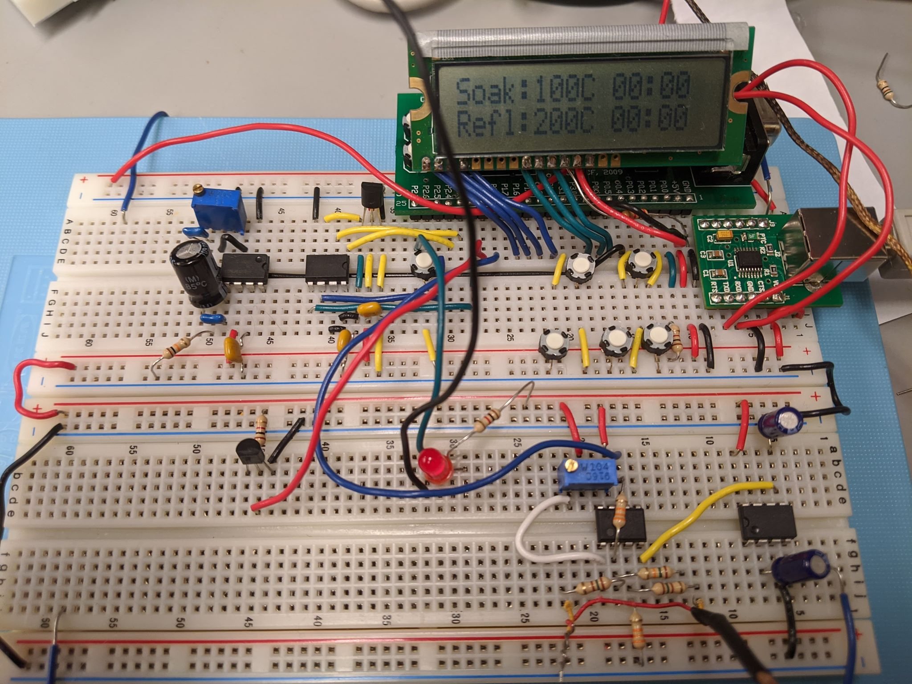
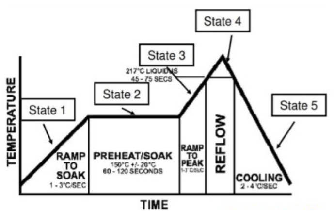
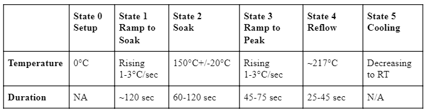
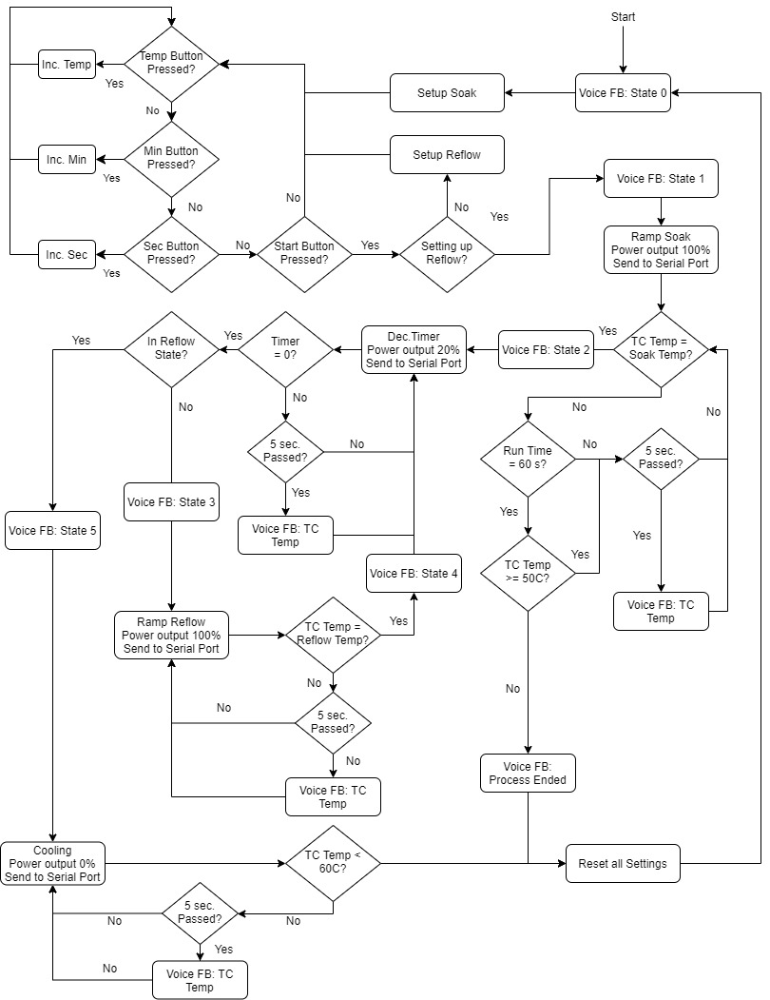
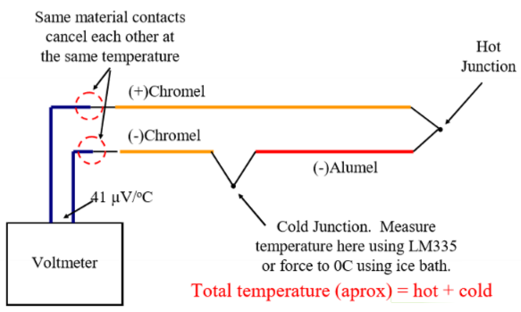
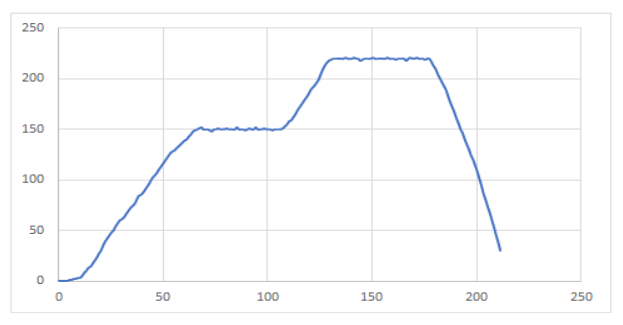
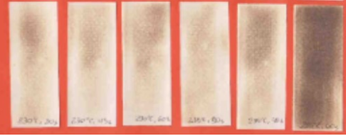
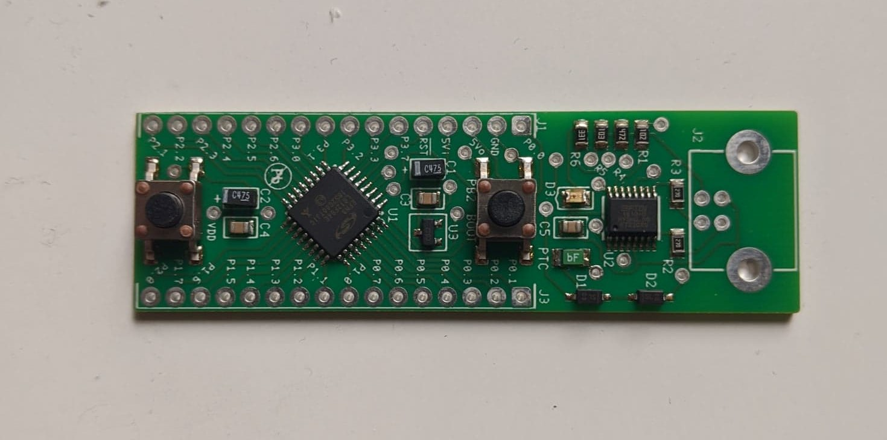

University of British Columbia  
ELEC 291

Team B8  
- Bryan Nsoh
- Will Chaba
- Isabelle Andre
- Debby Lin
- Eric Wu
- Daniel Nadeem

# Project 1 Reflow Oven Controller

A reflow oven controller connected to an oven to perform reflow soldering of electronic components onto a printed circuit board (PCB).

## Project Details

This project consisted in designing and programming a reflow oven controller that would heat up and attach components to the solder pads of an EFM8 PCB.
Reflow soldering is a common soldering technique used to assemble surface mount devices onto the PCB's pads coated with solder paste.
A heating process with mutliple stages of different temperature range melts the paste, thus linking the components. The designed reflow oven controller sets and executes the settings of a complete reflow process consisting of 6 states numbers 0 to 5 using a finite state machine. Folowing these states, the oven had to maintain set soak and reflow temperatures for specific time periods for each cycle of the reflow process. The controller varies the amount of power delivered to the oven via an SSR box through pulse width modulation (PWM). Temperature is read by inserting one end of a k-type thermocouple with cold junction compensation into the oven during the reflow process. The temperature is annouced every 5 seconds by speaker voice feedback as well as any state changes. As a safety feature, if the temperature read by the thermocouple did not rise to at least 60 degrees within the first 60 seconds of operation upon starting the process, the controller terminates the process.

*Completed Reflow Over Controller Circuit Board*

## Controller State Machine

The finite state machine implemented consists of 6 states.

*Reflow States*

### Reflow States

#### State 0: Settings

State 0 allows the soak and reflow temperature to be set before starting the process. A user interface with an liquid crystal display (LCD) screen and push buttons is used to choose soak temperature and time and reflow temperature and time. The user presses the Start button to proceed to the next state.

#### State 1: Ramp to Soak

In State 1, time is allocated to heat the oven until soak temperature is reached. The oven heats up at maximum power, usually heating up by 1-3 degrees per second. Current temperature is continually compared to the set soak temperature.  Voice feedback dictates the current temperature every 5 seconds. When the temperature has reached soak temperature, the code proceeds to State 2.

#### State 2: Soak

The temperature is kept stable at chosen temperature and the soak timer is enabled. Once the timer ends, State 3 begins.

#### State 3: Ramp to Reflow

Similarily to State 1, time is allocated to heat the oven until reflow temperature is reached. The oven heats up at maximum power, usually heating up by 1-3 degrees per second. Current temperature is continually compared to the set reflow temperature.  Voice feedback dictates the current temperature every 5 seconds. When the temperature has reached reflow temperature, the code proceeds to State 4.

#### State 4: Reflow

The temperature is kept stable at chosen temperature and the reflow timer is enabled. Once the timer ends, State 5 begins.

#### State 5: Cooling

At State 5, the oven is allowed to cool until the temperature reaches 60 degrees, after which the process ends and resets to State 1.

The approximate reflow settings used in the final demo can be observed in this table.

*Reflow Settings Temperature and Time*

### Software Block Diagram

*Controller Logic*

## Technical Components

### Thermocouple

To collect temperature data, an LM355 is connected to the onboard Analog to Digital Converter (ADC), to return the temperature of the cold junction of the thermocouple. The thermocouple measures a difference in temperature between the tip and the cold junction, therefore the cold junction and thermocouple temperatures are added to calculate the total temperature. The thermocouple voltage is first amplified by an inverting OP07 OpAmp. Once the voltage is read from the thermocouple, it is sent to a computer via the USB serial interface where a python script converts the voltage into a temperature in Celsius.

*Cold Junction Thermocouple*

### Power and Pulse Width Modulation (PWM)

The controller regulates the amount of power delivered to the oven using a technique called pulse width modulation (PWM). PWM is used to create an analog signal from a digital signal by changing the duty cycle of a constant frequency pulse waveform. The thermocouple temperature is continuously compared to the goal temperature. If the measured temperature is less than that of the goal temperature, the power turns on, while if the temperature exceed it, the power turns off. During the ramp to soak and ramp to reflow stages of the reflow process, the power delivered is at approximately 100% as the temperature rises. During the soak and reflow stages, the power delivered is at approximately 20% as the temperature is kept constant.

### Voce Feedback

Voice feedback from a speaker provided the oven temperature every 5 seconds with an audible readout. Sound files that stored the audio for numbers and stages of the reflow process generated. To store the audio files, a 25Q32JVAIQ flash storage chip is connected via  the Serial Peripheral Interface (SPI) to the P89 microcontroller. The speaker is first connectedto a LM386N-1 mono audio amplifier, then to the DAC on the P89 microcontroller. 

### User Interface

The user interface includes 5 push buttons and an LCD screen to display the settings. At State 0, the buttons for Temperature, Seconds, and Minutes are checked in a loop continuously to see if they are pressed. When pressed, they increment their individual BCD counters. After the soak settings are set, the Start button is pressed to flag the start of reflow settings. The reflow settings are set in a similar way, and once again the start button is pressed to proceed to State 1. Once in State 1, the Temperature Settings button now becomes the Mode button. The Mode button can be used to navigate through the reflow and soak timers and temperature, as well as display the current temperature of the termocouple and room temperature.

## Testing and Printed Circuit Board

Once all components assembled, the reflow process was tested with the settings set for soak at 150 degrees for 60 seconds and reflow at 220 degrees for 45 seconds. The thermocople temperature to time was observed during the process to plot a similar curve to that of the state graph, distinctly showing the different states of the reflow process.

*Live Temperature vs Time Plot of Reflow Process*

When placing a piece of paper in the oven, the test yielded in the paper showing lightly brown roasted as shown in the far left.

*Oven Paper Test*

Finally, solder paste was applied using a stencil to the EFM8 microcontroller PCB and components were placed on the solder pads before beginning the reflow process once more. The process successfully soldered all electrical components onto the board creating a fully functional EFM8 microcontroller to be used in future projects.

*Successfully Soldered EFM8 Microcontroller*

